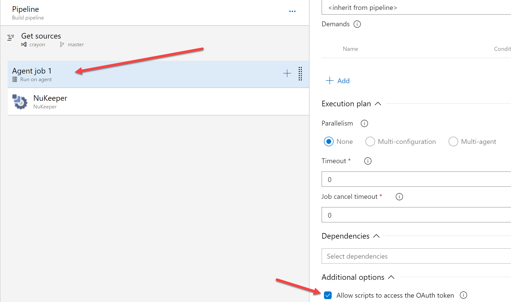

### NuKeeper AzureDevops Extension

This is the [NuKeeper](https://github.com/NuKeeperDotNet/NuKeeper) for [Azure DevOps](https://azure.microsoft.com/en-gb/services/devops/) / VSTS extension. It will allow you to run the NuKeeper command inside the users build pipeline.

You will find it [here in the Visual Studio marketplace](https://marketplace.visualstudio.com/items?itemName=nukeeper.nukeeper).

It's up to the user to schedule the pipeline in whatever is correct for their solution.

### Installation

Once installed you still have to give the extension access rights:

- Go to "Project settings" in your AzureDevops home screen.
- Click repositories
- Click Git repositories
- Click the build service User(the bottom one, something like: Project collection build service)

Give it the following rights:
- Contribute	Allow
- Contribute to pull requests	Allow
- Create branch	Allow

Allow NuKeeper your build agent to access the oauth token:

That should do it.
